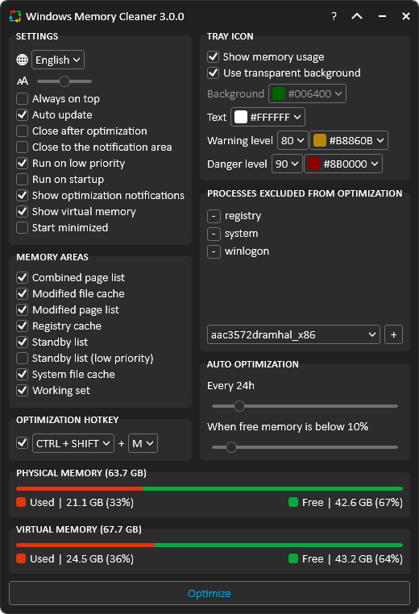
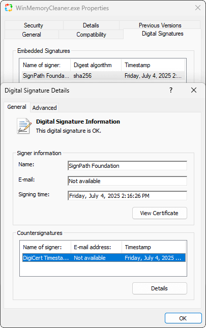
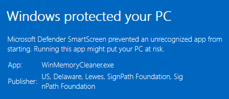
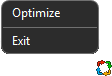
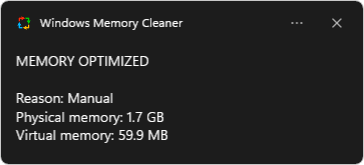
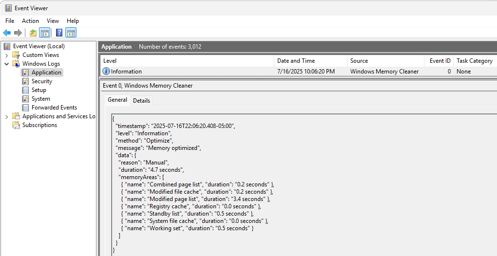

# Windows Memory Cleaner

   

This free RAM cleaner uses native Windows features to efficiently clear memory areas, helping to resolve slow performance caused by programs that fail to release allocated memory. With its user-friendly interface and smart functionality, this portable app requires no installation, though it does need administrator privileges to run.

## ⬇️ Download

### 🍫 Chocolatey
    choco install winmemorycleaner

### 🍦 Scoop
    scoop install winmemorycleaner

### 📦 WinGet
    winget install IgorMundstein.WinMemoryCleaner

## ✍️ A Note From the Developer

In the past, I struggled with having the hardware and software to enjoy the best of technology and gaming. It was a constant battle to squeeze every last drop of performance out of a limited machine.

Although today I might not need this tool for my own use, I maintain it in my free time for a simple reason: to help others who still face that struggle. I see this project as a form of social work—a contribution to the art of technology and a thank you to the beautiful open-source community that empowers us all.

This tool is for you. Knowing that it helps someone get a smoother experience, load a game faster, or simply feel less frustration with their computer is what motivates me. Real, true comments on how this tool helps you make my day.

## 🔴 The Problem: Inefficient Memory Management

Modern operating systems are good at managing memory, but they aren't perfect. Over time, RAM can become cluttered with cached data from closed applications (**Standby List**) or held unnecessarily by running processes (**Working Set**). This leads to system slowdowns, stuttering in applications, and reduced responsiveness, especially on systems with limited RAM.

The market for PC utilities is plagued by "RAM boosters" that use deceptive tricks and offer no real, verifiable benefits, creating deep-seated skepticism among users.

## ✅ The Solution: A Transparent, Evidence-Based Tool

WinMemoryCleaner is the antidote to "snake oil" utilities. It does not use undocumented hacks or harmful tricks. Instead, it provides a clean, user-friendly interface to powerful, **native Windows API functions** that give you direct control over your system's memory. It is a tool built on transparency, proof, and respect for the user.

## 🔐 Trust & Integrity

We understand that users are rightfully skeptical of system utilities. This project is built on a foundation of verifiable trust and transparency.

### Automated & Secure Builds (CI/CD)

Every official release of WinMemoryCleaner is built, signed, and published automatically by a **CI/CD pipeline using GitHub Actions**. The entire process is defined in the public [release.yml](/.github/workflows/release.yml) workflow file in this repository. This ensures that the distributed executables are compiled directly from the source code you see here, eliminating the potential for manual error or intervention.

### Verifiable Code Signing

Since version 3.0.0, we have been digitally signing our files through [SignPath.io](https://about.signpath.io/product/open-source) using a free certificate provided under the [SignPath Terms of Use](https://signpath.org/terms). The project received the certificate in recognition of its popularity and public value in the open-source community. This process ensures that we distribute authentic files that have not been tampered with.

A digital signature proves two things:
* **Authenticity:** The publisher of the file is who they say they are.
* **Integrity:** The file has not been altered or tampered with since it was signed.

You can verify the signature by right-clicking the `.exe` -> `Properties` -> `Digital Signatures`

### Microsoft Defender SmartScreen

Even with a valid digital signature, Microsoft Defender SmartScreen may initially flag a new release with a "Windows protected your PC" warning.

This happens because the application is new and has not yet built a strong reputation with Microsoft. This is a standard, reputation-based security measure. By running the app, you help it build a positive reputation, which will cause this warning to disappear more quickly for other users. We appreciate your trust and understanding.

### Independent Security Scans

Each new version is automatically submitted for analysis to leading security platforms, including VirusTotal and Hybrid Analysis, to ensure it is free from threats.

## 🚀 Key Features

| **Feature** | **Description** |
|:---|:---|
| **Always&nbsp;on&nbsp;Top** | Pins the main application window so it is always visible above other windows. |
| **Auto&nbsp;Optimization** | Set the app to clean memory automatically, either by period (`Every X hours`) or when free RAM drops below a specified percentage (`When free memory is below X percent`). |
| **Auto&nbsp;Update** | Automatically checks for new versions every 24 hours to keep the application up to date. |
| **Close&nbsp;after&nbsp;Optimization**| The application will automatically close after a memory optimization is completed. |
| **Close&nbsp;to&nbsp;Notification&nbsp;Area**| Minimizes the app to the system tray instead of closing when the 'X' button is clicked. |
| **Compact&nbsp;Mode** | Collapse the UI to a minimal view for at-a-glance monitoring using the arrow next to the minimize button. |
| **Global&nbsp;Hotkey** | Trigger an optimization instantly from anywhere with a customizable hotkey (default `CTRL+SHIFT+M`). |
| **Multi-Language&nbsp;Support** | Albanian, Arabic, Bulgarian, Chinese (Simplified), Chinese (Traditional), Dutch, English, French, German, Greek, Hebrew, Hungarian, Indonesian, Irish, Italian, Japanese, Korean, Macedonian, Norwegian, Persian, Polish, Portuguese, Russian, Serbian, Slovenian, Spanish, Thai, Turkish, and Ukrainian. |
| **Process&nbsp;Exclusion&nbsp;List** | Build a list of processes to ignore during memory optimization, protecting critical applications. |
| **Run&nbsp;on&nbsp;Low&nbsp;Priority**| Limits the app's resource usage by reducing its process priority. This may increase optimization time but can prevent system freezes. |
| **Run&nbsp;on&nbsp;Startup** | Automatically starts the application when Windows boots by creating a task in the Windows Task Scheduler. |
| **Show&nbsp;Virtual&nbsp;Memory**| Displays virtual memory (page file) usage in the main window and system tray text. |
| **Start&nbsp;Minimized**| The application will start minimized directly to the system tray. A single-click on the tray icon restores it. |

### System Tray (Notification area)

The application provides quick access and information directly from the system tray.

- **Menu**: A right-click menu offers quick access to trigger an optimization or exit the application.

  

- **Notification**: After an optimization, a notification appears showing the reason and the approximate amount of memory that was freed.

  

- **Tray Icon Customization**: The tray icon can be configured to display real-time physical memory usage instead of the app logo. You can customize the background and text colors, as well as set warning and danger level thresholds that change the icon's color based on current memory pressure.

## 🔬 Proof of Concept: See It Work Yourself

Don't take our word for it. You can verify the effects of this tool using Windows' own **Resource Monitor**.

1.  Open Resource Monitor (search `resmon.exe` in the Start Menu).
2.  Go to the **Memory** tab. Observe the blue "Standby" portion of the bar. This is RAM used for caching files from closed programs.
3.  Open and close a few large applications (a game, a browser, Photoshop). Watch the blue "Standby" section grow.
4.  In WinMemoryCleaner, select **only the `Standby List`** and click `Optimize`
5.  Watch the Resource Monitor again. The blue "Standby" memory will instantly drop, and the light green "Free" memory will increase by the same amount.

This is a direct, verifiable demonstration that the application converts cached memory into truly free memory, ready for your next task.

## 🔧 Technical Deep Dive: How It Works

WinMemoryCleaner provides a user-friendly interface for powerful, documented Windows API functions. There are no tricks or secrets—just direct access to the tools needed to manage your system's memory effectively. Each cleaning function targets a specific memory area, and its availability depends on your Windows version.

Here’s a breakdown of what each function does and the minimum supported Windows version required to use it:

| **Memory Areas** | **Description** | **Windows** | **Server** |
| :--- | :--- | :---: | :---: |
| **Combined&nbsp;Page&nbsp;List** | Flushes memory blocks from the page-combining list (a memory-saving feature in modern Windows that merges identical pages of memory). | 8+ | 2012+ |
| **Modified&nbsp;File&nbsp;Cache** | Flushes the volume file cache to disk for all fixed drives, ensuring all pending writes are committed. | XP+ | 2003+ |
| **Modified&nbsp;Page&nbsp;List** | Writes unsaved data ("dirty pages") from RAM to disk and moves the now-saved pages to the standby list. | Vista+ | 2008+ |
| **Registry&nbsp;Cache** | Flushes registry hives from memory. Hives are logical groups of keys and values that are loaded into memory when the OS starts or a user logs in. | 8.1+ | 2012+ |
| **Standby&nbsp;List** | Clears the entire Standby List, which contains cached data from closed applications. This is an aggressive method that frees the maximum amount of cached RAM for a demanding task. | Vista+ | 2008+ |
| **Standby&nbsp;List&nbsp;(low&nbsp;priority)** | Clears only the lowest-priority pages from the Standby List. This is a gentle method that frees some cached RAM without removing data Windows considers more important. | Vista+ | 2008+ |
| **System&nbsp;File&nbsp;Cache** | Flushes the cache Windows uses for its own system files. This can be useful for refreshing the system's state before launching a memory-intensive application. | XP+ | 2003+ |
| **Working&nbsp;Set** | Removes memory from all user-mode and system working sets. This forces processes (like games or browsers that hoard memory) to release non-essential RAM, which can reduce stutter and improve responsiveness. | XP+ | 2003+ |

## 🔳 Advanced Usage

### Command-Line Arguments

Run optimizations silently for scripting and automation. Use any combination of the following flags:

- `/CombinedPageList`
- `/ModifiedFileCache`
- `/ModifiedPageList`
- `/RegistryCache`
- `/StandbyList` or `/StandbyListLowPriority`
- `/SystemFileCache`
- `/WorkingSet`

**Shortcut target example:**

    C:\WinMemoryCleaner.exe /WorkingSet /StandbyList /SystemFileCache

### Windows Service Mode

For continuous, hands-off optimization, install the application as a background service. Run these commands from an administrator command prompt:

**Install Service:**

    C:\WinMemoryCleaner.exe /Install

**Uninstall Service:**

    C:\WinMemoryCleaner.exe /Uninstall

## 📖 Logs

All optimization activities are logged to the Windows Event Viewer for a transparent audit trail.

1. Press **Win + R**, type **eventvwr**, and press Enter.
2. Navigate to `Windows Logs > Application`
3. Look for events with the source name **Windows Memory Cleaner**

## ❓ Frequently Asked Questions (FAQ)

### How can I see the results for myself (Proof of Concept)?
The easiest effect to observe is clearing the **Standby List**. The Standby List is memory that Windows has cached from previously closed applications. While it's technically "available," it's not "free." You can see this for yourself:

1.  Open the **Resource Monitor** in Windows (you can search for `resmon.exe`).
2.  Go to the **Memory** tab. The blue "Standby" portion of the bar represents this cached memory.
3.  Now, open and close a few large applications (like a web browser, a game, or a document editor). You will see the blue "Standby" section grow as Windows caches those files.
4.  Run WinMemoryCleaner and select only the **Standby List** for optimization.
5.  Watch the Resource Monitor. The blue "Standby" memory will drop significantly, and the light green "Free" memory will increase by the same amount.

This is tangible proof that the application is directly manipulating these memory areas as advertised, converting cached (Standby) memory into truly Free memory.

### Is this app still useful on modern PCs, and how is it not 'snake oil'?
This is an excellent question that gets to the core of this project's philosophy.

**The short answer:** Yes, it's still useful for a massive number of users, and it's the opposite of snake oil because it's built on transparency and verifiable proof.

**The longer answer:** We've all been burned. The PC utility market has a dark history of deceptive "boosters" that preyed on users' frustrations. They were the T-Virus of the software world, promising performance but often making things worse with shady, undocumented tricks. That history creates a lot of justified prejudice.

WinMemoryCleaner is the **antivirus serum**. It's not a magical cure-all, but a targeted, clean, and honest tool. Here's why it's different and still relevant:

* **It's for the Majority, Not Just the Elite:** While a brand-new PC with 64GB of RAM and Windows 11 might not see a dramatic difference, that's not the reality for most. The most common amount of RAM on Steam is still just **16GB**. This tool is for the student with an 8GB laptop, the gamer on a budget, and the developer running multiple VMs who needs to reclaim every last megabyte.
* **It Gives You Control:** Modern Windows is good at memory management, but it's automated. It doesn't know you're about to launch a massive game and need all available RAM *right now*. This tool lets you make that decision yourself by clearing cached memory (the Standby List) on demand.
* **It's Verifiable:** As shown in the "Proof of Concept" section, you don't have to trust us blindly. You can use Windows' own tools to see the app working in real-time. We're not hiding anything.
* **It's Built on Honesty:** The code is open-source, and every function it performs is a documented, native Windows API call. We are simply providing a safe and easy-to-use interface for powerful system maintenance tasks that already exist.

This project exists to serve the users who were left behind by the march of technology, and to restore faith that a utility can be both effective and honest.

### What are the project requirements?
- Minimalistic user interface using (WPF) and single-page application (SPA) architecture
- Model-View-ViewModel (MVVM) design pattern
- No third-party dependencies
- Portable (Single executable file)
- Right-to-left language support and bidirectional text
- Use of S.O.L.I.D. principles in object-oriented programming (limited due to the legacy .NET 4.0 framework)
- Use of Windows native methods for memory management
- Windows Event to save logs
- Windows Presentation Foundation (WPF) for user interface
- Windows retro compatibility (Windows XP, Server 2003, and later)

### Where does the app save the settings?
They are saved in the Windows registry path `Computer\HKEY_LOCAL_MACHINE\Software\WinMemoryCleaner`

### Why has the app been flagged as Malware/Virus and blocked by Windows Defender, SmartScreen, or Antivirus?
One of the reasons for this **false alarm** is that the application adds entries to the registry and creates a scheduled task to run at startup. Windows doesn't suggest letting applications with administrator privileges run at startup. I understand that, but this is the way to do it. I apologize, but the application cannot perform a deep memory clean without administrator privileges.

That's a common issue that persists with every new app version. I constantly submit the executable to Microsoft. Usually, it takes up to 72 hours for Microsoft to remove the detection.
It helps if more users [submit the app for malware analysis](https://www.microsoft.com/en-us/wdsi/filesubmission)

Meanwhile, as a workaround, you can [add an exclusion to Windows Security](https://support.microsoft.com/en-us/windows/add-an-exclusion-to-windows-security-811816c0-4dfd-af4a-47e4-c301afe13b26)

## 🌐 Translation

If you are a native speaker of any language other than English, you can contribute by translating the file: [English.json](/src/Resources/Localization/English.json)

💡 You can test any translation by creating a file alongside the executable
1. Visit [https://ss64.com/locale.html](https://ss64.com/locale.html) to get the **locale description** of the language
2. Save it as **{locale-description}.json** using **UTF-8** as character encoding
3. Launch the application. If successful, the new language and changes will be visible
4. Either submit a pull request or upload the file to the [translation discussion](https://github.com/IgorMundstein/WinMemoryCleaner/discussions/14)

💡 If you are a .NET developer

1. You can add the new file to the Resources\Localization folder
2. Change the file build action property to Embedded Resource
3. Rebuild and run the WinMemoryCleaner project

💡 AI translation tools will be utilized when a new version requires changes to the translated text. The contributor's efforts to submit updates are always appreciated.

| **Language** | **Contributor(s)** | **Language** | **Contributor(s)** |
|:---|:---|:---|:---|
| 🇦🇱&nbsp;Albanian | [Omer Rustemi](https://github.com/omerrustemicode) | 🇯🇵&nbsp;Japanese | [dai](https://github.com/dai) |
| 🇸🇦&nbsp;Arabic | [Abdulmajeed Al-Rajhi](https://github.com/Abdulmajeed-Alrajhi) | 🇰🇷&nbsp;Korean | [VenusGirl](https://github.com/VenusGirl) |
| 🇧🇬&nbsp;Bulgarian | [Konstantin](https://github.com/constantinejc) | 🇲🇰&nbsp;Macedonian | [Dimitrij Gjorgji](https://github.com/Cathadox) |
| 🇨🇳&nbsp;Chinese&nbsp;(Simplified) | [KaiHuaDou](https://github.com/KaiHuaDou), [Kun Zhao](https://github.com/kzhdev), [Rayden](https://github.com/raydenake22) | 🇳🇴&nbsp;Norwegian | [Dan](https://github.com/danorse) |
| 🇨🇳&nbsp;Chinese&nbsp;(Traditional) | [Rayden](https://github.com/raydenake22), [rtyrtyrtyqw](https://github.com/rtyrtyrtyqw) | 🇮🇷&nbsp;Persian | [Kavian](https://github.com/KavianK) |
| 🇳🇱&nbsp;Dutch | [Jesse](https://github.com/dragonhuntermc), [hax4dazy](https://github.com/hax4dazy) | 🇵🇱&nbsp;Polish | [Patryk](https://github.com/Fresta56) |
| 🇫🇷&nbsp;French | [William VINCENT](https://github.com/wixaw) | 🇧🇷&nbsp;Portuguese | Owner |
| 🇩🇪&nbsp;German | [Calvin](https://github.com/Slluxx), [Niklas Englmeier](https://github.com/iamniklas), [Steve](https://github.com/uDEV2019) | 🇷🇺&nbsp;Russian | [Ruslan](https://github.com/ruslooob) |
| 🇬🇷&nbsp;Greek | [Theodoros Katsageorgis](https://github.com/tkatsageorgis) | 🇷🇸&nbsp;Serbian | [Dragoš Milošević](https://github.com/DragorMilos) |
| 🇮🇱&nbsp;Hebrew | [Eliezer Bloy](https://github.com/eliezerbloy) | 🇸🇮&nbsp;Slovenian | [Jadran Rudec](https://github.com/JadranR) |
| 🇭🇺&nbsp;Hungarian | [Csizmadia Gyorgy](https://github.com/gycsisz) | 🇪🇸&nbsp;Spanish | [Ajneb Al Revés](https://github.com/AjnebAlReves), [Fran](https://github.com/FrannDzs) |
| 🇮🇩&nbsp;Indonesian | [Mochammad Misbahus Surur](https://github.com/Eskeyz), [Minids](https://github.com/tdnphantom) | 🇹🇭&nbsp;Thai | [nongice](https://github.com/21icepril) |
| 🇮🇪&nbsp;Irish | [Happygolucky254](https://github.com/Happygolucky254) | 🇹🇷&nbsp;Turkish | [Rıza Emet](https://github.com/rizaemet), [Viollje](https://github.com/Viollje) |
| 🇮🇹&nbsp;Italian | [Michele](https://github.com/wintrymichi) | 🇺🇦&nbsp;Ukrainian | [Riebi](https://github.com/RieBi), [Oleksandr](https://github.com/Mariachi1231) |

## ❤️ Support the Project

If you find this app helpful, consider donating. Your donation helps keep the project alive, optimized, and free for everyone.

- [Sponsor on GitHub](https://github.com/sponsors/IgorMundstein)
- [Buy me a coffee on Ko-fi](https://ko-fi.com/igormundstein)
- [Bitcoin (BTC)](https://www.blockchain.com/btc/address/bc1qu884q5r2uqugvdhyk8l6waakumeve7jykqp7ap)
- [Ethereum (ETH)](https://www.blockchain.com/explorer/addresses/eth/0xb71A94733B0578D155D9A765E0d2C4dA0f44156d)
