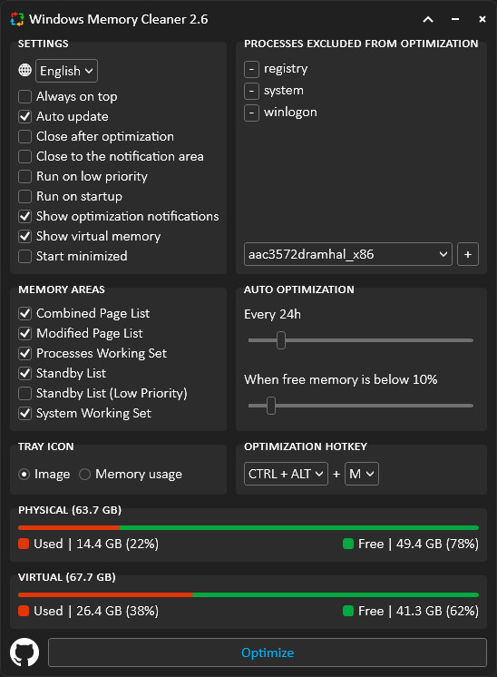
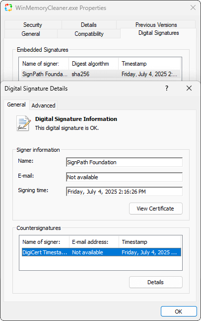
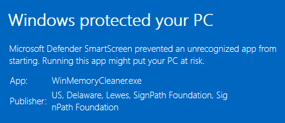
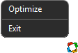
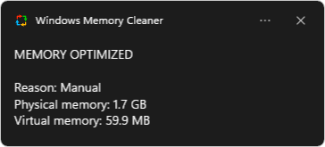
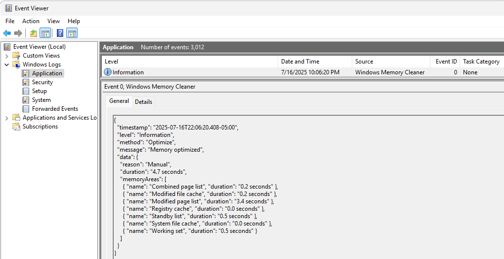

<div align="center">
  <h1>Windows Memory Cleaner</h1>

  [](/LICENSE) [](https://github.com/IgorMundstein/WinMemoryCleaner/releases/latest/)

  <p align="justify">
This free RAM cleaner uses native Windows features to efficiently clear memory areas, helping to resolve slow performance caused by programs that fail to release allocated memory. With its user-friendly interface and smart functionality, this portable app requires no installation, though it does need administrator privileges to run.
  </p>
</div>

  [](#windows-memory-cleaner)

## ⬇️ Download

[](https://github.com/IgorMundstein/WinMemoryCleaner/releases/latest/download/WinMemoryCleaner.exe)

### 🍫 Chocolatey
  ```powershell
  choco install winmemorycleaner
  ```

### 🍦 Scoop
  ```powershell
  scoop install winmemorycleaner
  ```

### 📦 WinGet
  ```powershell
  winget install IgorMundstein.WinMemoryCleaner
  ```

## 🔐 Trust & Integrity

We prioritize transparency and user safety. Since version 3.0.0, we have been digitally signing our files through [SignPath.io](https://about.signpath.io/product/open-source) using a free certificate provided under the [SignPath Terms of Use](https://signpath.org/terms). The project received the certificate in recognition of its popularity and public value in the open-source community. This process ensures that we distribute authentic files that have not been tampered with. By doing this, we will build trust with Microsoft Defender SmartScreen over time, and maybe someday we will obliterate that "Windows protected your PC" warning.

### 🔍 How to verify

- **Windows UI**

1. Right-click on executable 
2. Properties
3. Go to Digital Signatures tab

[](#-trust--integrity)

- **Command-line**
  
```cmd
signtool verify /pa WinMemoryCleaner.exe
```

### 🔷 Microsoft Defender SmartScreen

Even with clean security reports and a valid digital signature, Microsoft Defender SmartScreen may initially flag a new release with a "Windows protected your PC" warning.

[](#-microsoft-defender-smartscreen)

This happens because the application is new and hasn't yet built a reputation with Microsoft. Our files are digitally signed to verify their authenticity and ensure they haven't been tampered with. This warning is a standard security measure for any new software.

This is a standard reputation-based security measure for new files that haven't been seen by many users yet. By running the app, you help it build a positive reputation, which will cause this warning to disappear more quickly for other users. We appreciate your trust and understanding.

By the end, to ensure transparency and safety, each new version is submitted for analysis to leading security platforms, including:

- Hybrid Analysis
- Microsoft Security Intelligence
- VirusTotal

## 🚀 Features

### Auto optimization

- `Every X hours` The optimization will run by period
- `When free memory is below X percent` The optimization will run if free memory is below the specified percentage

### Compact Mode

- Arrow (Up/Down) next to the minimize button to collapse and extend the window

[](#compact-mode)

### Memory Areas

- `Combined page list` Flushes the blocks from the combined page list effectively only when page combining is enabled
- `Modified file cache` Flushes volume file cache to disk
- `Modified page list` Flushes memory from the modified page list, writing unsaved data to disk, and moving the pages to the standby list
- `Registry cache` Flushes registry hives. A hive is a logical group of keys, subkeys, and values in the registry that has a set of supporting files loaded into memory when the operating system is started or a user logs in
- `Standby list` Flushes pages from all standby lists to the free list
- `Standby list (low priority)` Flushes pages from the lowest-priority standby list to the free list
- `System file cache` Flushes memory from the system file cache
- `Working set` Removes memory from all user-mode and system working sets and moves it to the standby or modified page lists

### Multi-Language

- `Albanian` `Arabic` `Bulgarian` `Chinese` `Dutch` `English` `French` `German` `Greek` `Indonesian` `Hebrew` `Hungarian` `Indonesian` `Irish` `Italian` `Japanese` `Korean` `Macedonian` `Norwegian` `Persian` `Polish` `Portuguese` `Russian` `Serbian` `Slovenian` `Spanish` `Thai` `Turkish` `Ukrainian`

### Processes excluded from optimization

- You can build a list of processes to ignore when memory is optimized

### Optimization hotkey

- Set a global keyboard hotkey to run the optimization. `CTRL + SHIFT + M` is the default and customizable value. It can be disabled if you don't want to use it

### Settings

- `Always on top` Pins the window to the top of all your windows
- `Auto update` Keeps the app up to date. It checks for updates every 24 hours
- `Close after optimization` Closes the app after optimization
- `Close to the notification area` Minimize the app to the system tray when clicking the close (X) button
- `Run on low priority` It limits the app's resource usage by reducing the process priority and ensuring it runs efficiently. It might increase the optimization time, but it helps if your Windows freezes during it
- `Run on startup` Runs the app after the system boots up. It creates a task on Windows **Task Scheduler**
- `Show optimization notifications` Sends a message to the notification area after optimization. It includes the approximate memory released
- `Show virtual memory` It also monitors the virtual memory usage
- `Start minimized` The app will start minimized to the system tray. Single-click on the icon to restore

### System tray (Notification area)

- Menu

[](#system-tray-notification-area)

- Notification

[](#system-tray-notification-area)

### Tray icon

- `Show memory usage` Display the physical memory usage instead of the application image
- `Use transparent background` Set the background to transparent
- `Background` Set the background color
- `Text` Set the text color
- `Warning/Danger levels` Set the danger and warning level thresholds and colors for memory usage. The icon will change color based on the memory usage

## 🔳 Command‑line arguments (no GUI)

You can use the following command‑line arguments to run the optimization silently.

🔳 Memory areas
- `/CombinedPageList`
- `/ModifiedFileCache`
- `/ModifiedPageList`
- `/RegistryCache`
- `/StandbyList` **OR** `/StandbyListLowPriority`
- `/SystemFileCache`
- `/WorkingSet`

💡 Shortcut target example

```cmd
C:\WinMemoryCleaner.exe /CombinedPageList /ModifiedFileCache /ModifiedPageList /RegistryCache /StandbyList /SystemFileCache /WorkingSet
```

## 🔧 Windows Service

You can install and run the app as a service.

To install or uninstall the service, run the app using the `/Install` or `/Uninstall` parameters in a command prompt with administrator privileges.

💡 Example 

```cmd
C:\WinMemoryCleaner.exe /Install
```

```cmd
C:\WinMemoryCleaner.exe /Uninstall
```

The installation will close some processes to install or uninstall the service without requiring a system restart, and log files will be generated along with the .exe file. Some application settings will be modified based on recommendations. You can still open the application (GUI) and configure it as desired. The service will utilize these settings.

[](#-windows-service)

## 📖 Logs

The app generates logs in the Windows Event

1. Press **Win + R** to open the Run command dialog box
2. Type **eventvwr** and press **Enter** to open the Event Viewer

[](#-logs)

## ❓ Frequently Asked Questions (FAQ)

### What are the project requirements?

- Minimalistic user interface using (WPF) and single-page application (SPA) architecture
- Model-View-ViewModel (MVVM) design pattern
- No third-party dependencies
- Portable (Single executable file)
- Right-to-left language support and bidirectional text
- Use of S.O.L.I.D. principles in object-oriented programming (limited due to the legacy .NET 4.0 framework)
- Use of Windows native methods for memory management
- Windows Event to save logs
- Windows Presentation Foundation (WPF) for user interface
- Windows retro compatibility (Windows XP, Server 2003, and later)

### Where does the app save the settings?

They are saved in the Windows registry path `Computer\HKEY_LOCAL_MACHINE\Software\WinMemoryCleaner`

### Why has the app been flagged as Malware/Virus and blocked by Windows Defender, SmartScreen, or Antivirus?

One of the reasons for this **false alarm** is that the application adds entries to the registry and creates a scheduled task to run at startup. Windows doesn't suggest letting applications with administrator privileges run at startup. I understand that, but this is the way to do it. I apologize, but the application cannot perform a deep memory clean without administrator privileges.

That's a common issue that persists with every new app version. I constantly submit the executable to Microsoft. Usually, it takes up to 72 hours for Microsoft to remove the detection.
It helps if more users [submit the app for malware analysis](https://www.microsoft.com/en-us/wdsi/filesubmission)

Meanwhile, as a workaround, you can [add an exclusion to Windows Security](https://support.microsoft.com/en-us/windows/add-an-exclusion-to-windows-security-811816c0-4dfd-af4a-47e4-c301afe13b26)

## 🌐 Translation

If you are a native speaker of any language other than English, you can contribute by translating the file: [English.json](/src/Resources/Localization/English.json)

💡 You can test any translation by creating a file alongside the executable
1. Visit [https://ss64.com/locale.html](https://ss64.com/locale.html) to get the **locale description** of the language
2. Save it as **{locale-description}.json** using **UTF-8** as character encoding
3. Launch the application. If successful, the new language and changes will be visible
4. Either submit a pull request or upload the file to the [translation discussion](https://github.com/IgorMundstein/WinMemoryCleaner/discussions/14)

💡 If you are a .NET developer

1. You can add the new file to the Resources\Localization folder
2. Change the file build action property to Embedded Resource
3. Rebuild and run the WinMemoryCleaner project

💡 AI translation tools will be utilized when a new version requires changes to the translated text. The contributor's efforts to submit updates are always appreciated.

⭐ Contributors

- `Albanian (Shqip)` [Omer Rustemi](https://github.com/omerrustemicode)
- `Arabic (اللغة العربية)` [Abdulmajeed-Alrajhi](https://github.com/Abdulmajeed-Alrajhi)
- `Bulgarian (български)` [Konstantin](https://github.com/constantinejc)
- `Chinese (Simplified) (中文(简体))` [KaiHuaDou](https://github.com/KaiHuaDou) | [Kun Zhao](https://github.com/kzhdev) | [raydenake22](https://github.com/raydenake22)
- `Chinese (Traditional) (中文(繁體))` [raydenake22](https://github.com/raydenake22) | [rtyrtyrtyqw](https://github.com/rtyrtyrtyqw)
- `Dutch (Nederlands)` [dragonhuntermc](https://github.com/dragonhuntermc) | [hax4dazy](https://github.com/hax4dazy)
- `French (Français)` [William VINCENT](https://github.com/wixaw)
- `German (Deutsch)` [Calvin](https://github.com/Slluxx) | [Niklas Englmeier](https://github.com/iamniklas) | [Steve](https://github.com/uDEV2019)
- `Greek (Ελληνικά)` [tkatsageorgis](https://github.com/tkatsageorgis)
- `Hebrew (עברית)` [eliezerbloy](https://github.com/eliezerbloy)
- `Hungarian (Magyar)` [gycsisz](https://github.com/gycsisz)
- `Indonesian (Indonesia)` [Eskey](https://github.com/Eskeyz) | [Pufminids](https://github.com/tdnphantom)
- `Irish (Gaeilge)` [Happygolucky254](https://github.com/Happygolucky254)
- `Italian (Italiano)` [wintrymichi](https://github.com/wintrymichi)
- `Japanese (日本語)` [dai](https://github.com/dai)
- `Korean (한국어)` [VenusGirl](https://github.com/VenusGirl)
- `Macedonian (Македонски)` [Dimitrij Gjorgji](https://github.com/Cathadox)
- `Norwegian (Norsk)` [danorse](https://github.com/danorse)
- `Persian (فارسی)` [KavianK](https://github.com/KavianK)
- `Polish (Polski)` [Fresta56](https://github.com/Fresta56)
- `Russian (Русский)` [ruslooob](https://github.com/ruslooob)
- `Serbian (Srpski)` [DragorMilos](https://github.com/DragorMilos)
- `Slovenian (Slovenščina)` [Jadran Rudec](https://github.com/JadranR)
- `Spanish (Español)` [Ajneb Al Revés](https://github.com/AjnebAlReves) | [Nekrodamus](https://github.com/FrannDzs)
- `Thai (ไทย)` [nongice](https://github.com/21icepril)
- `Turkish (Türkçe)` [Rıza Emet](https://github.com/rizaemet) | [Viollje](https://github.com/Viollje)
- `Ukrainian (Українська)` [RieBi](https://github.com/RieBi) | [Oleksander](https://github.com/Mariachi1231)

## ❤️ Support the Project

If you find this app helpful, consider donating. Your donation helps keep the project alive, optimized, and free for everyone.

- [Sponsor on GitHub](https://github.com/sponsors/IgorMundstein)
- [Buy me a coffee on Ko-fi](https://ko-fi.com/igormundstein)
- [Bitcoin (BTC)](https://www.blockchain.com/btc/address/bc1qu884q5r2uqugvdhyk8l6waakumeve7jykqp7ap)
- [Ethereum (ETH)](https://www.blockchain.com/explorer/addresses/eth/0xb71A94733B0578D155D9A765E0d2C4dA0f44156d)
