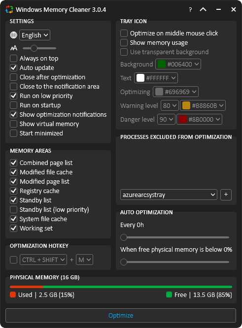
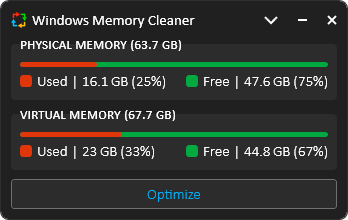
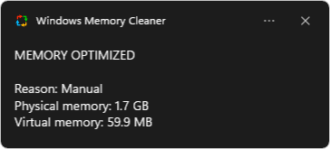
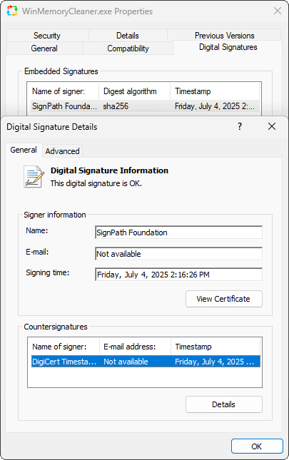
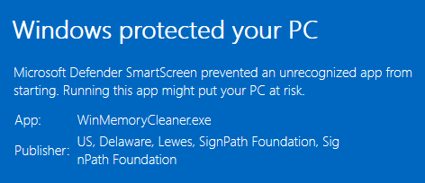
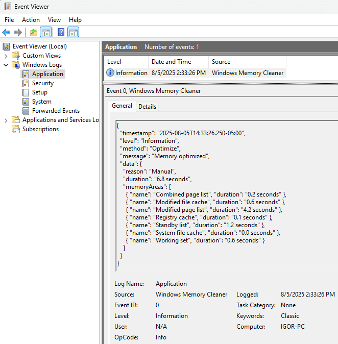

# Windows Memory Cleaner

[](#windows-memory-cleaner) [](#windows-memory-cleaner) [](/LICENSE) [](https://github.com/IgorMundstein/WinMemoryCleaner/releases/latest) [](https://dotnet.microsoft.com/download/dotnet/8.0)

> **Note:** Version `3.0.8` was the last release supporting **Windows XP / Vista / Server 2003-2008** (`.NET Framework 4.0`). From `3.1.0` the project targets **.NET 8.0** (`net8.0-windows`, Windows 7 SP1 / Server 2012+). The legacy `3.0.x` branch remains available for retro systems. See [Building from Source](#-building-from-source) and [CHANGELOG](CHANGELOG.md).

WMC is a free RAM cleaner that effectively optimizes memory areas by utilizing the native Windows API. This can help improve performance when programs do not properly release allocated memory. Featuring a user-friendly interface and intelligent functionality, this portable application requires no installation; however, it does need administrator privileges to run.

[](#windows-memory-cleaner)

## 💾 Download

[](https://github.com/IgorMundstein/WinMemoryCleaner/releases/latest/download/WinMemoryCleaner.exe)

### 🍫 [Chocolatey](https://community.chocolatey.org/packages/winmemorycleaner)

```cmd
choco install winmemorycleaner
```

### 🍦 [Scoop](https://scoop.sh/#/apps?q=winmemorycleaner&o=true&dm=true&n=true)

```cmd
scoop bucket add extras
```

```cmd
scoop install extras/winmemorycleaner
```

### 📦 [WinGet](https://winstall.app/apps/IgorMundstein.WinMemoryCleaner)

```cmd
winget install IgorMundstein.WinMemoryCleaner
```

## 🚀 Features

| Feature | Description |
|:---|:---|
| **Always&nbsp;on&nbsp;Top** | Pins the main application window so it is always visible above other windows. |
| **Auto&nbsp;Optimization** | Set the app to clean memory automatically, either by period (`Every X hours`) or when free physical RAM drops below a specified threshold (`When free physical memory is below X percent`). |
| **Auto&nbsp;Update** | Automatically checks for new versions every 24 hours to keep the application up to date. |
| **Close&nbsp;after&nbsp;Optimization** | The application will automatically close after a memory optimization is completed. |
| **Close&nbsp;to&nbsp;Notification&nbsp;Area** | Minimizes the app to the system tray instead of closing when the 'X' button is clicked. |
| **Compact&nbsp;Mode** | Collapse the main window into a minimal view for at-a-glance monitoring. |
| **Font&nbsp;Size&nbsp;Adjustment** | Customize the font size for different screen sizes and resolutions. |
| **Global&nbsp;Hotkey** | Trigger an optimization instantly from anywhere with a customizable hotkey (default `CTRL+SHIFT+M`). |
| **Hotkey&nbsp;Toggle** | Enable or disable the global optimization hotkey independently. |
| **Multi-Language&nbsp;Support** | Albanian, Arabic, Bulgarian, Chinese (Simplified), Chinese (Traditional), Dutch, English, French, German, Greek, Hebrew, Hungarian, Indonesian, Irish, Italian, Japanese, Korean, Macedonian, Norwegian, Persian, Polish, Portuguese (Brazil), Portuguese (Portugal), Russian, Serbian, Slovenian, Spanish, Thai, Turkish, and Ukrainian. |
| **Process&nbsp;Exclusion&nbsp;List** | Build a list of processes to ignore during memory optimization, protecting critical applications. |
| **Run&nbsp;on&nbsp;Low&nbsp;Priority** | Limits the app's resource usage by reducing its process priority. This may increase optimization time but can prevent system freezes. |
| **Run&nbsp;on&nbsp;Startup** | Automatically starts the application when Windows boots by creating a task in the Windows Task Scheduler. |
| **Show&nbsp;Optimization&nbsp;Notifications** | Display system tray notifications after each optimization, showing the reason and amount of memory freed. |
| **Show&nbsp;Virtual&nbsp;Memory** | Displays virtual memory (page file) usage in the main window and system tray text. |
| **Start&nbsp;Menu&nbsp;Shortcut** | Automatically creates a Start Menu shortcut for quick access to the application. |
| **Start&nbsp;Minimized** | The application will start minimized directly to the system tray. A single-click on the tray icon restores it. |
| **Tray&nbsp;Icon&nbsp;Customization** | Customize tray icon colors (background, text, warning, danger, optimizing), display memory usage, set threshold levels, and enable middle-click optimization. |

### ↕️ Compact Mode

The Compact Mode feature allows you to collapse the main window into a minimal view for at-a-glance monitoring. By clicking the arrow next to the minimize button, the UI shrinks to show only the most essential memory statistics and controls. This mode is ideal for users who want to keep an eye on their system’s memory usage without occupying much screen space. Toggle Compact Mode on or off at any time to suit your workflow.

[](#%EF%B8%8F-compact-mode)

### 🔔 System Tray (Notification Area)

The application provides quick access and information directly from the system tray.

- **Menu**: A right-click menu offers quick access to trigger an optimization or exit the application.

  - Optimize
  - Exit
 
- **Notification**: After an optimization, a notification appears showing the reason and the approximate amount of memory that was freed.

  [](#-system-tray-notification-area)

- **Tray Icon Customization**: The tray icon can be configured to:

  - Customize background, danger, optimizing, text, and warning colors
  - Display real-time physical memory usage instead of the app logo
  - Enable middle mouse click to trigger optimization
  - Set danger and warning level thresholds that automatically change icon colors
  - Use transparent background when showing memory usage
  - Visual rotation effect during optimization

## 🧬 Technical Deep Dive: How It Works

WinMemoryCleaner provides a user-friendly interface for powerful, documented Windows API functions. There are no tricks or secrets—just direct access to the tools needed to manage your system's memory effectively. Each cleaning function targets a specific memory area, and its availability depends on your Windows version.

Here’s a breakdown of what each function does and the minimum supported Windows version required to use it:

| Memory Area | Description | Windows | Server |
| :--- | :--- | :---: | :---: |
| **Combined&nbsp;Page&nbsp;List** | Flushes memory blocks from the page-combining list, a memory-saving feature in modern Windows that merges identical pages of memory. | 8+ | 2012+ |
| **Modified&nbsp;File&nbsp;Cache** | Flushes the volume file cache to disk for all fixed drives, ensuring all pending writes are committed. | XP+ | 2003+ |
| **Modified&nbsp;Page&nbsp;List** | Writes unsaved pages from RAM to disk and moves the now-saved pages to the standby list. | Vista+ | 2008+ |
| **Registry&nbsp;Cache** | Flushes registry hives from memory. Hives are logical groups of keys and values that are loaded into memory when the OS starts or a user logs in. | 8.1+ | 2012+ |
| **Standby&nbsp;List** | Clears the entire Standby List, which contains cached data from closed applications. This aggressive method frees the maximum amount of cached RAM for demanding tasks. | Vista+ | 2008+ |
| **Standby&nbsp;List&nbsp;(low&nbsp;priority)** | Clears only the lowest-priority pages from the Standby List. This gentle method frees some cached RAM without removing data that Windows considers more important. | Vista+ | 2008+ |
| **System&nbsp;File&nbsp;Cache** | Flushes the cache Windows uses for its system files, trimming it to release memory. Useful for refreshing the system’s state before launching a memory-intensive application. | XP+ | 2003+ |
| **Working&nbsp;Set** | Removes memory from all user-mode and system working sets, forcing processes (like games or browsers that hoard memory) to release non-essential RAM. This can reduce stutter and improve responsiveness. | XP+ | 2003+ |

## 🔴 The Problem: Inefficient Memory Management

Modern operating systems are good at managing memory, but they aren't perfect. Over time, RAM can become cluttered with cached data from closed applications (**Standby List**) or held unnecessarily by running processes (**Working Set**). This leads to system slowdowns, stuttering in applications, and reduced responsiveness, especially on systems with limited RAM.

The market for PC utilities is plagued by "RAM boosters" that use deceptive tricks and offer no real, verifiable benefits, creating deep-seated skepticism among users.

## ✅ The Solution: A Transparent, Evidence-Based Tool

WinMemoryCleaner is the antidote to "snake oil" utilities. It does not use undocumented hacks or harmful tricks. Instead, it provides a clean, user-friendly interface to powerful, **native Windows API functions** that give you direct control over your system's memory. It is a tool built on transparency, proof, and respect for the user.

## 🔎 Proof of Concept: See It Work Yourself

Don't take our word for it. You can verify the effects of this tool using Windows' own **Resource Monitor**.

1. Open Resource Monitor (search `resmon.exe` in the Start Menu).
2. Go to the **Memory** tab. Observe the blue "Standby" portion of the bar. This is RAM used for caching files from closed programs.
3. Now, open and close a few large applications (a game, a browser, Photoshop). Watch the blue "Standby" section grow.
4. In WinMemoryCleaner, select **only the `Standby List`** and click `Optimize`.
5. Watch the Resource Monitor again. The blue "Standby" memory will instantly drop, and the light green "Free" memory will increase by the same amount.

This is a direct, verifiable demonstration that the application converts cached memory into truly free memory, ready for your next task.

## 🔒 Trust & Integrity

We understand that users are rightfully skeptical of system utilities. This project is built on a foundation of verifiable trust and transparency.

### 🔑 Automated & Secure Builds (CI/CD)

Every official release of WinMemoryCleaner is built, signed, and published automatically by a **CI/CD pipeline using GitHub Actions**. The entire process is defined in the public [release.yml](/.github/workflows/release.yml) workflow file in this repository. This ensures that the distributed executables are compiled directly from the source code hosted on GitHub, eliminating the potential for manual error or intervention.

### 🔑 Verifiable Code Signing

Since version 3.0.0, we have been digitally signing our files through [SignPath.io](https://about.signpath.io/product/open-source) using a free certificate provided under the [SignPath Terms of Use](https://signpath.org/terms). The project received the certificate in recognition of its popularity and public value in the open-source community. This process ensures that we distribute authentic files that have not been tampered with.

> **3.1.0 note:** The migration to SDK-style `.NET 8.0` (`src/WinMemoryCleaner.csproj:1`, `GenerateAssemblyInfo false`, `SignAssembly false`) temporarily disables strong-name signing in this branch. Release signing will be re-enabled via `SignPath` once the new pipeline is validated. `3.0.8` remains the last signed `net40` release.

A digital signature proves two things:
* **Authenticity:** The publisher of the file is who they say they are.
* **Integrity:** The file has not been altered or tampered with since it was signed.

You can verify the signature by right-clicking the `.exe` -> `Properties` -> `Digital Signatures`

[](#-trust--integrity)

### 🔑 Microsoft Defender SmartScreen

Even with a valid digital signature, Microsoft Defender SmartScreen may initially flag a new release with a "Windows protected your PC" warning.

[](#-microsoft-defender-smartscreen)

This happens because the application is new and has not yet built a strong reputation with Microsoft. This is a standard, reputation-based security measure. By running the app, you help it build a positive reputation, which will cause this warning to disappear more quickly for other users. We appreciate your trust and understanding.

### 🔑 Independent Security Scans

Each new version is automatically submitted for analysis to leading security platforms, including VirusTotal and Hybrid Analysis, to ensure it is free from threats.

## 💻 Automation & Deployment

You must run these headless operations with administrator privileges.

### 🔳 Console Mode

Run optimizations silently for scripting and automation. Use any combination of the following arguments:

- `/CombinedPageList`
- `/ModifiedFileCache`
- `/ModifiedPageList`
- `/RegistryCache`
- `/StandbyList` or `/StandbyListLowPriority`
- `/SystemFileCache`
- `/WorkingSet`

**> Command-line example:**

```cmd
{path}\WinMemoryCleaner.exe /ModifiedFileCache /StandbyList /WorkingSet
```

### ⚙️ Windows Service Mode

For continuous, hands-off optimization, install the application as a background service. The installation will close some processes to install or uninstall the service without requiring a system restart, and log files will be generated along with the .exe file. Some application settings will be modified based on recommendations. You can still open the application (GUI) and configure it as desired. The service will utilize these settings.

> **3.1.0:** Service installer rewritten — `src/WindowsService/WinServiceInstaller.cs:1` no longer uses `System.Configuration.Install`/`ManagedInstallerClass`; it now uses `sc.exe` (`sc create`/`sc config`/`sc delete`) + `ServiceController` with `DelayedAutoStart`, proper `Stop`/`WaitForStatus` and `sc.exe` error logging. Log path `WinMemoryCleaner.log` via `InstallHelper` removed.

✅ **Install Service:**
```cmd
{path}\WinMemoryCleaner.exe /Install
```

❌ **Uninstall Service:**
```cmd
{path}\WinMemoryCleaner.exe /Uninstall
```

## 🔧 Troubleshooting

### ⚠️ Application flagged as Malware/Virus:

One of the reasons for this **false alarm** is that the application adds entries to the registry and creates a scheduled task to run at startup. Windows doesn't suggest letting applications with administrator privileges run at startup. I understand that, but this is the required method for this functionality. I apologize, but the application cannot perform a deep memory clean without administrator privileges.

This is a common issue that persists with every new app version. I constantly submit the executable to Microsoft. Usually, it takes up to 72 hours for Microsoft to remove the detection.

**Solutions:**

- **Recommended: Use a Package Manager** — If you frequently encounter false positive detections, auto-update issues, or SmartScreen warnings, we **strongly recommend** installing via [Chocolatey](#-chocolatey), [Scoop](#-scoop), or [WinGet](#-winget). These package managers provide:
  
  - Automated update mechanisms that bypass Windows security warnings
  - Community-verified distribution channels
  - No manual download/verification steps required
  - Reduced exposure to false positive antivirus flags
  - Simplified version management with single-command updates

  **Example update commands:**

  ```cmd
  choco upgrade winmemorycleaner
  ````
  
  ```cmd
  scoop update winmemorycleaner
  ```

  ```cmd
  winget upgrade IgorMundstein.WinMemoryCleaner
  ```

- If auto-update fails or you need a verified build, download the latest release from the **Download** section above or the Releases page and manually replace your existing `WinMemoryCleaner.exe`. Run the new file as administrator.
- Long-term solution: please submit the app to Microsoft for malware analysis to reduce false positives: [submit for analysis](https://www.microsoft.com/en-us/wdsi/filesubmission)
- Quick workaround: add an exclusion to your antivirus app allowlist or to [Windows Security](https://support.microsoft.com/en-us/windows/add-an-exclusion-to-windows-security-811816c0-4dfd-af4a-47e4-c301afe13b26)

#### Verify & replace executable (safe replacement)

If you suspect the binary is corrupted, tampered, or the auto-update fails, follow these safe-replacement steps.

- Simple (non-technical):

  1. Download the latest release from the **Download** section above or the Releases page on GitHub.
  2. Right-click the downloaded file → **Properties** → **Digital Signatures** and verify the signer and timestamp.
  3. Rename your current `WinMemoryCleaner.exe` to `WinMemoryCleaner.exe.bak` (backup).
  4. Move the new `WinMemoryCleaner.exe` into place and run it as administrator.
  5. If the new version works, delete the `.bak`. To roll back, restore the `.bak` file.

- Advanced (recommended best practices):

  1. Export current settings (registry): `reg export "HKLM\Software\WinMemoryCleaner" WinMemoryCleaner-reg-backup.reg`
  2. Download the official release and obtain the published SHA256 from the release notes (if provided).
  3. Verify the file hash:

     ```powershell
     Get-FileHash .\WinMemoryCleaner.exe -Algorithm SHA256
     ```

-   4. Verify the Authenticode signature:
  
     ```powershell
     Get-AuthenticodeSignature .\WinMemoryCleaner.exe
     ```

     Confirm `Status` is `Valid` and signer is expected.

  5. Stop running instances (and scheduled task if present) before replacing:

     ```powershell
     Stop-Process -Name WinMemoryCleaner -ErrorAction SilentlyContinue
     ```

  6. Backup and replace safely:

     ```powershell
     Move-Item .\WinMemoryCleaner.exe WinMemoryCleaner.exe.bak
     Copy-Item C:\path\to\downloaded\WinMemoryCleaner.exe .\
     Start-Process .\WinMemoryCleaner.exe -Verb RunAs
     ```

  7. Check Event Viewer (`eventvwr` → Windows Logs → Application) for errors. Roll back by restoring the `.bak` and re-enabling tasks if needed.

### 🔄 Reset to Factory Defaults

**⚠️ Use this to restore factory defaults** - If the app keeps crashing, won't open, or is stuck in a loop, this will terminate frozen windows, disable auto-update, and restore the application to its factory default state.

**What happens when you reset to factory defaults:**

- All your custom settings are reverted to the application's factory defaults (your language choice is preserved)
- Any frozen or stuck app windows will be closed
- Auto-update is turned off and must be re-enabled manually in the application settings
- The app returns to its original state

**Command to run (one-line)**

```cmd
{path}\WinMemoryCleaner.exe /Reset
```

**Step-by-step (guided)**

1. Click **Start**, type `cmd`.
2. Right-click **Command Prompt** → **Run as administrator**.
3. Type (or drag-and-drop) the full path to `WinMemoryCleaner.exe`, then type a space and add `/Reset`.

   Example:

   ```cmd
   "C:\Downloads\WinMemoryCleaner.exe" /Reset
   ```

   > **💡 TIP:** Drag and drop `WinMemoryCleaner.exe` into the Command Prompt — it inserts the full path. If the path contains spaces, enclose it in double quotes before adding ` /Reset`.

4. Press **Enter**.
5. The app will reset and close. Open it normally to use it again.

### 📋 View Application Logs

All optimization activities and essential operations are logged to the Windows Event Viewer for a transparent audit trail.

**Steps to view logs:**
1. Press **Win + R**, type **eventvwr**, and press Enter
2. Navigate to `Windows Logs > Application`
3. Look for events with the source name **Windows Memory Cleaner**

[](#-logs)

## 🏗️ Building from Source

> **Prerequisites:** Windows 7 SP1+ / Server 2012+, [.NET 8.0 SDK](https://dotnet.microsoft.com/download/dotnet/8.0), no admin required to *build* (admin required to *run* optimizations).

```powershell
# 1. Clone (or your fork)
git clone https://github.com/IgorMundstein/WinMemoryCleaner.git
cd WinMemoryCleaner

# 2. Restore & build (Debug)
dotnet restore src/WinMemoryCleaner.csproj
dotnet build   src/WinMemoryCleaner.csproj -c Release

# 3. Publish single-file (framework-dependent, default)
dotnet publish src/WinMemoryCleaner.csproj -c Release -o publish

# 3b. Publish self-contained single exe (no runtime install needed, larger)
dotnet publish src/WinMemoryCleaner.csproj -c Release -r win-x64 --self-contained true `
  /p:PublishSingleFile=true /p:IncludeAllContentForSelfExtract=true -o publish/self-contained

# 4. Run as admin (optimizations require elevation)
Start-Process .\publish\WinMemoryCleaner.exe -Verb RunAs
# or CLI:
.\publish\WinMemoryCleaner.exe /StandbyList /WorkingSet
```

**Key changes in 3.1.0 (see `CHANGELOG.md`):**

- **Project:** `src/WinMemoryCleaner.csproj:1` migrated from legacy `.NET Framework 4.0` (345 lines, `packages.config`, `FxCopAnalyzers`) to SDK-style `net8.0-windows` (69 lines), `UseWPF`/`UseWindowsForms`, `LangVersion latest`, `Nullable disable`, `ImplicitUsings disable`.
- **JSON:** `src/Core/Helper.cs:7` `JavaScriptSerializer`/`DataContractJsonSerializer` → `System.Text.Json` (`JsonOptions` CamelCase + `JsonStringEnumConverter`, `JsonDocument`), `src/Core/Localizer.cs:8`/`src/Model/Localization.cs:3` setters `private set` → `set` for deserialization, fallback `_fallbackLocalization` + multi-dir search (`Resources/Localization`, `Resources/Themes`).
- **Updater:** `src/Core/Updater.cs:9` `WebClient`+`ServicePointManager`+regex on `AssemblyInfo.cs` → `HttpClient` (30s timeout) + `Constants.cs:80` `ApiLatestReleaseUri` (`https://api.github.com/repos/.../releases/latest`, `tag_name`), `async Task<Version> CheckForUpdatesAsync()`, `File.WriteAllBytesAsync`.
- **Service:** `src/WindowsService/WinServiceInstaller.cs:1` `System.Configuration.Install`/`Installer` → `static` + `sc.exe` (`create`/`config`/`delete`, `ServiceController`, `WaitForStatus`), removes `WinMemoryCleaner.log` via `ManagedInstallerClass`.
- **Interop:** `src/Interop/NativeMethods.cs:6` `[SupportedOSPlatform("windows")]`, `CharSet.Unicode` fixes, `DwmSetWindowAttribute` `int` return; `src/Interop/ShellInterop.cs:49` local `IPersistFile` (removes `System.Runtime.InteropServices.ComTypes`).
- **Core modernization:** `src/Core/Logger.cs:17` `lock _syncLock` + `Dispose()` + `EnableConsoleOutput()` thread-safe, `src/Core/Settings.cs:13` `nameof()` replaces `Helper.NameOf(() => ...)` + `ICom` removal, `src/Core/ThemeManager.cs:22` `new()`/`Regex` target-typed `new`, `src/Core/ObservableObject.cs:29` `OnPropertyChanged`/`RaisePropertyChanged` split, `src/ViewModel/Base/ViewModel.cs:45` `IsBusy`/`Navigate` null-guarded `Dispatcher` removal, `src/Attribute/CallerMemberNameAttribute.cs:1` shim deleted (built-in), `src/Properties/AssemblyInfo.cs:14` `3.0.8.0` → `3.1.0.0`.
- **Deps:** `src/packages.lock.json:3` `net8.0-windows7.0` (`System.Drawing.Common 8.0.7`, `System.Diagnostics.EventLog 8.0.1`, `System.ServiceProcess.ServiceController 8.0.1`).

Legacy `3.0.8` (`net40`) remains the last XP/2003-compatible build. For collaboration see [CONTRIBUTING](.github/CONTRIBUTING.md) (branch from `main`, C# conventions, PR template).

## 🛠️ Complementary Tools

While **Windows Memory Cleaner** excels at efficiently managing and freeing up memory, the following tools can provide even deeper insights into your system's memory usage and help with advanced troubleshooting:

### 🔧 [Process Explorer](https://learn.microsoft.com/en-us/sysinternals/downloads/process-explorer)

An advanced task manager from Microsoft Sysinternals that goes beyond what's available in Windows Task Manager. It provides comprehensive information about processes, including their memory usage, handles, and DLLs. Useful for identifying specific applications or services that might be consuming excessive memory.

### 🔧 [RAMMap](https://learn.microsoft.com/en-us/sysinternals/downloads/rammap)

A powerful physical memory usage analysis utility from Microsoft Sysinternals. RAMMap provides detailed, real-time information about how Windows is allocating physical memory, including how much is in use by processes, drivers, the kernel, and various cached data. **It also contains some cleaning features that address certain memory areas similar to Windows Memory Cleaner.** It's an excellent tool to use alongside WinMemoryCleaner to understand precisely *where* memory is being used before and after an optimization.

## ❓ Frequently Asked Questions (FAQ)

### 💭 Is this app still useful on modern PCs, and how is it not 'snake oil'?

This is an excellent question that gets to the core of this project's philosophy.

**The short answer:** Yes, it's still useful for a massive number of users, and it's the opposite of snake oil because it's built on transparency and verifiable proof.

**The longer answer:** We've all been burnt. The PC utility market has a dark history of deceptive "boosters" that preyed on users' frustrations. They were the T-Virus of the software world, promising performance but often making things worse with shady, undocumented tricks. That history creates a lot of justified prejudice.

WinMemoryCleaner is the **antivirus serum**. It's not a magical cure-all, but a targeted, clean, and honest tool. Here's why it's different and still relevant:

* **It's for the Majority, Not Just the Elite:** While a brand-new PC with 64GB of RAM might not see a dramatic difference, that's not the reality for the average user. To understand what typical PCs look like, we can look at the Steam Hardware & Software Survey, which collects data from millions of gamers worldwide. According to this survey, the most common amount of RAM is just 16GB. This tool is built for that majority: the student with an 8GB laptop, the gamer on a budget with 16GB, and the developer running multiple virtual machines who needs to reclaim every last megabyte to keep their system running smoothly.
* **It Gives You Control:** Modern Windows is good at memory management, but it's automated. It doesn't know you're about to launch a massive game and need all available RAM *right now*. This tool lets you make that decision yourself by clearing cached memory (the Standby List) on demand.
* **It's Verifiable:** As shown in the "Proof of Concept" section, you don't have to trust us blindly. You can use Windows' own tools to see the app working in real-time. We're not hiding anything.
* **It's Built on Honesty:** The code is open-source, and every function it performs is a documented, native Windows API call. We are simply providing a safe and easy-to-use interface for powerful system maintenance tasks that already exist.

This project exists to serve the users who were left behind by the march of technology, and to restore faith that a utility can be both effective and honest.

### 💭 What are the project requirements?

- Logging to Windows Event Viewer
- Minimalistic user interface using Windows Presentation Foundation (WPF) and single-page application (SPA) architecture
- Model-View-ViewModel (MVVM) design pattern
- No third-party dependencies (framework libraries only — `System.Text.Json`, `System.Drawing.Common`, `System.ServiceProcess` via .NET 8)
- Portable (Single executable file — framework-dependent or self-contained publish)
- Right-to-left language support and bidirectional text
- Use of S.O.L.I.D. principles in modern C# (.NET 8.0, `net8.0-windows`, `LangVersion latest`)
- Use of Windows API methods for memory management (`SupportedOSPlatform("windows")`)
- Windows 7 SP1 / Server 2012 and later (Windows XP / Server 2003 supported on legacy `3.0.8` / `net40` branch — see note at top)
- .NET 8.0 SDK, SDK-style project (`src/WinMemoryCleaner.csproj:1`), `System.Text.Json` + `HttpClient` via GitHub Releases API (`src/Core/Constants.cs:80` `ApiLatestReleaseUri`), async `Updater` (`src/Core/Updater.cs:9`)

### 💭 Where does the app save the settings?

They are saved in the Windows registry path `Computer\HKEY_LOCAL_MACHINE\Software\WinMemoryCleaner`

### 💭 Why has the app been flagged as Malware/Virus and blocked by Windows Defender, SmartScreen, or Antivirus?

One of the reasons for this **false alarm** is that the application adds entries to the registry and creates a scheduled task to run at startup. Windows doesn't suggest letting applications with administrator privileges run at startup. I understand that, but this is the required method for this functionality. I apologize, but the application cannot perform a deep memory clean without administrator privileges.

That's a common issue that persists with every new app version. I constantly submit the executable to Microsoft. Usually, it takes up to 72 hours for Microsoft to remove the detection.
It helps if more users [submit the app for malware analysis](https://www.microsoft.com/en-us/wdsi/filesubmission)

Meanwhile, as a workaround, you can [add an exclusion to Windows Security](https://support.microsoft.com/en-us/windows/add-an-exclusion-to-windows-security-811816c0-4dfd-af4a-47e4-c301afe13b26)

## 🛠️ Contributing

We welcome contributions! Please see our [Contribution Guidelines](.github/CONTRIBUTING.md) for details on:

- **Code Style**: Follow existing C# conventions, use `LangVersion latest`, SDK-style projects
- **Pull Requests**: Branch from `main`, include tests for new features
- **Translations**: See [Translation](#-translation) section below
- **Bug Reports**: Use the [Bug Report template](https://github.com/IgorMundstein/WinMemoryCleaner/issues/new?template=bug_report.yml)
- **Feature Requests**: Use the [Feature Request template](https://github.com/IgorMundstein/WinMemoryCleaner/issues/new?template=feature_request.yml)

### Quick Start for Contributors

```bash
# 1. Fork & clone
git clone https://github.com/YOUR_FORK/WinMemoryCleaner.git
cd WinMemoryCleaner

# 2. Build & test
dotnet restore src/WinMemoryCleaner.csproj
dotnet build src/WinMemoryCleaner.csproj -c Release

# 3. Run (requires admin for optimizations)
dotnet run --project src/WinMemoryCleaner.csproj -c Release
```

### Key Changes in 3.1.0+ (Modernization)

| Area | Before (3.0.x) | After (3.1.0+) |
|------|----------------|----------------|
| **Framework** | .NET Framework 4.0 | .NET 8.0 (`net8.0-windows`) |
| **Project Format** | Legacy `.csproj` + `packages.config` | SDK-style `.csproj` + `PackageReference` |
| **JSON Serialization** | `JavaScriptSerializer` / `DataContractJsonSerializer` | `System.Text.Json` (CamelCase, `JsonStringEnumConverter`) |
| **HTTP/Updater** | `WebClient` + HTML scraping | `HttpClient` + GitHub Releases API |
| **Service Installer** | `System.Configuration.Install` | `sc.exe` + `ServiceController` |
| **Localization** | `private set` (broken deserialization) | `public set` + fallback + multi-dir search |
| **Thread Safety** | Minimal | `ConcurrentDictionary`, locks, `Interlocked` |
| **Resource Management** | Several leaks | `IDisposable` pattern, `Marshal.AllocHGlobal` |
| **Exceptions** | Many empty `catch { }` | Logged with context |
| **Converters** | `NotImplementedException` on `ConvertBack` | Full two-way binding |
| **Manifest** | `requireAdministrator` | `highestAvailable` (self-elevates when needed) |

## 🌐 Translation

If you're a native speaker of a language other than English, you can contribute by translating the [English.json](/src/Resources/Localization/English.json) file.

**Please note:** Translated texts should be provided in **lowercase**. The application will automatically handle capitalization as needed for the user interface.

### 🔬 How to Test Your Translation

You can test any translation by creating a file alongside the executable:

1. Visit [https://ss64.com/locale.html](https://ss64.com/locale.html) to get the **locale description** for your language.
2. Save your translation as **{locale-description}.json** using **UTF-8** character encoding.
3. Launch the application. If successful, the new language and your changes will be visible.
4. Once tested, please either submit a pull request or submit the file via the **[Translation Request](https://github.com/IgorMundstein/WinMemoryCleaner/issues/new?template=translation_request.yml)** issue template.

### 👨‍💻 For Developers

If you are a software developer, you can integrate the new file directly into the project:

1. Add the new file to the `Resources\Localization` folder.
2. Change the file's **Build Action** property to `Embedded Resource`.
3. Rebuild and run the `WinMemoryCleaner` project.

When new versions require translation updates, we may use AI tools to provide a baseline. We always value and encourage contributions from native speakers to refine and perfect these translations.

| Language | Contributor(s) | Language | Contributor(s) |
|:---|:---|:---|:---|
| 🇦🇱&nbsp;Albanian | [Omer Rustemi](https://github.com/omerrustemicode) | 🇯🇵&nbsp;Japanese | [dai](https://github.com/dai) |
| 🇸🇦&nbsp;Arabic | [Abderraouf FELLAHI](https://github.com/flh-raouf), [Abdulmajeed Al-Rajhi](https://github.com/Abdulmajeed-Alrajhi) | 🇰🇷&nbsp;Korean | [VenusGirl](https://github.com/VenusGirl) |
| 🇧🇬&nbsp;Bulgarian | [Konstantin](https://github.com/constantinejc) | 🇲🇰&nbsp;Macedonian | [Dimitrij Gjorgji](https://github.com/Cathadox) |
| 🇨🇳&nbsp;Chinese&nbsp;(Simplified) | [KaiHuaDou](https://github.com/KaiHuaDou), [Kun Zhao](https://github.com/kzhdev), [Rayden](https://github.com/raydenake22) | 🇳🇴&nbsp;Norwegian | [Dan](https://github.com/danorse) |
| 🇨🇳&nbsp;Chinese&nbsp;(Traditional) | [Rayden](https://github.com/raydenake22), [rtyrtyrtyqw](https://github.com/rtyrtyrtyqw) | 🇮🇷&nbsp;Persian | [Kavian](https://github.com/KavianK) |
| 🇳🇱&nbsp;Dutch | [Jesse](https://github.com/dragonhuntermc), [hax4dazy](https://github.com/hax4dazy) | 🇵🇱&nbsp;Polish | [Patryk](https://github.com/Fresta56) |
| 🇫🇷&nbsp;French | [William VINCENT](https://github.com/wixaw) | 🇵🇹&nbsp;Portuguese&nbsp;(Portugal) | AI |
| 🇩🇪&nbsp;German | [Calvin](https://github.com/Slluxx), [Niklas Englmeier](https://github.com/iamniklas), [Steve](https://github.com/uDEV2019) | 🇷🇺&nbsp;Russian | [Ruslan](https://github.com/ruslooob) |
| 🇬🇷&nbsp;Greek | [Theodoros Katsageorgis](https://github.com/tkatsageorgis) | 🇷🇸&nbsp;Serbian | [Dragoš Milošević](https://github.com/DragorMilos) |
| 🇮🇱&nbsp;Hebrew | [Eliezer Bloy](https://github.com/eliezerbloy) | 🇸🇮&nbsp;Slovenian | [Jadran Rudec](https://github.com/JadranR) |
| 🇭🇺&nbsp;Hungarian | [gycsisz](https://github.com/gycsisz) | 🇪🇸&nbsp;Spanish | [Ajneb Al Revés](https://github.com/AjnebAlReves), [Fran](https://github.com/FrannDzs) |
| 🇮🇩&nbsp;Indonesian | [Mochammad Misbahus Surur](https://github.com/Eskeyz), [Minids](https://github.com/tdnphantom) | 🇹🇭&nbsp;Thai | [nongice](https://github.com/21icepril) |
| 🇮🇪&nbsp;Irish | [Happygolucky254](https://github.com/Happygolucky254) | 🇹🇷&nbsp;Turkish | [Rıza Emet](https://github.com/rizaemet), [Viollje](https://github.com/Viollje) |
| 🇮🇹&nbsp;Italian | [Michele](https://github.com/wintrymichi) | 🇺🇦&nbsp;Ukrainian | [Riebi](https://github.com/RieBi), [Oleksandr](https://github.com/Mariachi1231) |

## ❤️ Support the Project

In the past, I faced challenges with the proper hardware and software needed to fully enjoy technology and gaming. It was a constant battle to squeeze every last drop of performance out of a limited machine.

Although I may not rely on this tool as much as I once did, I continue to maintain it in my free time for a simple reason: to assist others who still encounter similar challenges. This project is a contribution to the field of technology and a tribute to the wonderful open-source community that supports us all.

If you find this app helpful, please consider tipping. Your contribution helps keep the project alive, optimized, and free for everyone.

| 💰 Cash | 🪙 Crypto |
| :--- | :--- |
| [Sponsor on GitHub](https://github.com/sponsors/IgorMundstein) | [Bitcoin (BTC)](https://www.blockchain.com/btc/address/bc1qu884q5r2uqugvdhyk8l6waakumeve7jykqp7ap) |
| [Buy me a coffee on Ko-fi](https://ko-fi.com/igormundstein) | [Ethereum (ETH)](https://www.blockchain.com/explorer/addresses/eth/0xb71A94733B0578D155D9A765E0d2C4dA0f44156d) |

---

## 📋 Summary of Fixes in 3.1.0+

This release represents a complete modernization from .NET Framework 4.0 to .NET 8.0 with 90+ issues addressed:

### Critical Fixes
- ✅ **OS Version Detection**: Fixed `Major >= 6.2` bug (int vs double comparison)
- ✅ **Localization**: Removed `.Capitalize()` from setters (corrupted non-English text)
- ✅ **Manifest**: `requireAdministrator` → `highestAvailable` (self-elevates when needed)
- ✅ **Single-File**: Added `EnableAssemblyResourceLoader` for embedded resources
- ✅ **Circular Dependency**: Broke Localizer ↔ Settings with lazy initialization

### Thread Safety & Concurrency
- ✅ `Settings`: Thread-safe with locks + `ConcurrentDictionary` for ProcessExclusionList
- ✅ `HotKeyService`: `ConcurrentDictionary` for registered hotkeys
- ✅ `WinService`: `Interlocked` guard prevents concurrent optimization
- ✅ `Logger`: Thread-safe console output + auto-dispose on ProcessExit

### Resource Leaks Fixed
- ✅ `Updater`: `HttpClient.Dispose()` implemented
- ✅ `WinService`: `IDisposable` + `Timer.Dispose()`
- ✅ `ComputerService`: `GCHandle.Alloc` → `Marshal.AllocHGlobal/FreeHGlobal` (6 methods)
- ✅ `NotificationService`: Icon handle leaks fixed with try/finally
- ✅ All `IDisposable` patterns properly implemented

### Exception Handling
- ✅ 40+ empty `catch { }` → `Logger.Debug("context: " + ex.Message)`
- ✅ `NotImplementedException` → `ArgumentOutOfRangeException` in converters/extensions
- ✅ Converters: `ConvertBack` implemented (NullToVisibility, BrushToHex, StringFormat)
- ✅ `SetPriority`: All `Enums.Priority` cases handled

### Performance
- ✅ `NotificationService`: Cached Font, StringFormat, Brushes
- ✅ `MainViewModel`: Cached Brushes collection
- ✅ `WinService`: Cached ServiceController
- ✅ BitArray → Brian Kernighan bit counting
- ✅ Lock granularity improvements

### GitHub Issues Addressed (21 open)
- #200 Virtual memory reporting
- #199 Event Viewer structured logging
- #198 Tray icon font size control
- #197 .new file cleanup
- #196 WPF Server 2003 fallback
- #194 Tray icon startup timing
- #193 Stability fixes
- #191 App hangs
- #190 Last optimization status
- #189 CLI args for optimize
- #185 Intermittent freezing
- #183 Slovenian localization
- #182 Task Scheduler UTF-8
- #179 Graph paged memory (backlog)
- #177 Update check errors
- #174 DPI scaling
- #170 Window positioning
- #146 Lag during cleanup
- #131 Process-triggered optimization
- #109 Virtual memory usage
